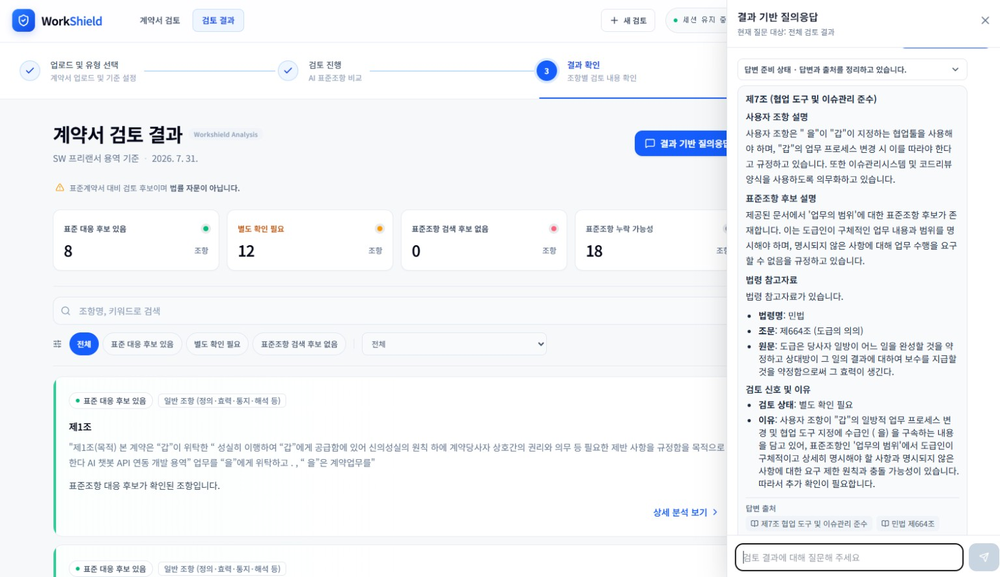
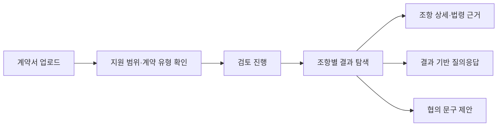
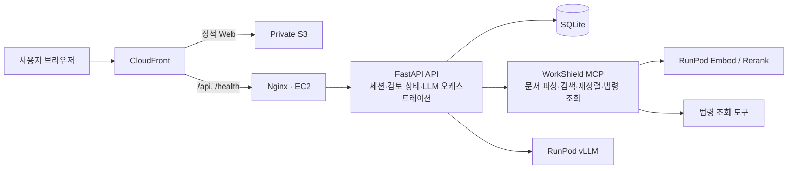

<div align="center">

# 🛡️ WorkShield

**표준계약서 대비 검토 후보를 찾고, 근거 기반 설명과 협의 문구를 제공하는 IT·SW 계약서 검토 보조 플랫폼**

</div>

> WorkShield는 법률 자문이나 위법·합법 판정을 제공하지 않습니다.  
> 사용자 계약서와 공개 표준계약서를 비교해 **우선 확인할 조항과 근거 후보를 좁혀 주는 도구**입니다.

<p align="center">
  
</p>
<p align="center"><sub>계약서 조항별 검토 결과와 결과 기반 질의응답 화면</sub></p>

---

## 프로젝트 소개

### 팀원

<table>
  <tr align="center">
    <td></td>
    <td></td>
    <td></td>
    <td></td>
    <td></td>
  </tr>
  <tr align="center">
    <td><b>박세빈</b></td>
    <td><b>홍철민</b></td>
    <td><b>김효선</b></td>
    <td><b>장규원</b></td>
    <td><b>박지유</b></td>
  </tr>
</table>

### 문제 정의

SW 프리랜서 용역과 SI·SM 하도급 계약은 업무 범위, 대금 지급, 지식재산권, 계약 변경처럼 중요한 조건이 계약마다 다르게 작성됩니다. 사용자가 계약서 전체를 표준계약서 및 관련 법령과 직접 대조하기에는 시간과 전문 지식의 부담이 크고, 일반적인 LLM 답변은 근거가 불분명하거나 법적 결론처럼 받아들여질 위험이 있습니다.

WorkShield는 계약서를 조항 단위로 구조화한 뒤 계약 유형에 맞는 표준조항을 검색·재정렬하여, 다음 검토 대상을 명시적인 상태와 근거로 제공합니다. 이후 질의응답과 협의 문구 생성도 현재 계약서, 검토 결과, 연결된 법령 자료의 범위 안에서 수행합니다.

### 지원 범위

- **계약 유형**: SW 프리랜서 용역, SI 하도급, SM 하도급
- **문서 형식**: PDF, HWP, HWPX, DOCX
- **결과 성격**: 법률 판단이 아닌 표준 대비 검토 후보와 참고 설명

### 주요 기능

| 기능 | 설명 |
| --- | --- |
| 계약서 업로드·유형 확인 | 파일 형식과 문서 상태를 검증하고, 지원 범위 및 비교할 계약 유형을 분석합니다. 사용자가 유형을 직접 확인하거나 변경할 수 있습니다. |
| 조항별 표준계약서 비교 | 사용자 조항과 표준조항을 비교해 `표준 대응 후보 있음`, `별도 확인 필요`, `검색 후보 없음` 상태로 구분합니다. |
| 표준조항 누락 가능성 탐색 | 표준계약서에는 있으나 사용자 계약서에서 대응 조항을 찾지 못한 항목을 별도 체크리스트로 제공합니다. |
| 주의 문구·법령 근거 연결 | 일방적 업무 변경, 지식재산권 귀속 등 알려진 주의 문구의 유사 신호를 표시하고, 필요한 결과에 관련 법령 원문을 연결합니다. |
| 결과 기반 질의응답 | 현재 검토 결과와 출처에 한정해 답변하며, 사용자 조항·표준조항·법령 근거를 함께 제시합니다. |
| 협의 문구 제안 | 사용자 조항과 대응 표준조항을 근거로 참고용 대안 문구를 생성합니다. 미확정 조건은 임의로 채우지 않고 확인 필요 항목으로 남깁니다. |
| 임시 세션과 데이터 보호 | 익명 세션을 사용하고 계약서와 대화 이력을 영구 저장하지 않습니다. 계약서 원문, 프롬프트, 대화 본문은 운영 로그에 남기지 않습니다. |

### 사용자 흐름



---

## 아키텍처



- **로컬 환경**에서는 API가 MCP 서버를 `stdio` 자식 프로세스로 실행하고 세션을 재사용합니다.
- **운영 환경**에서는 API와 MCP를 EC2의 Docker Compose로 실행하며 `streamable HTTP`로 연결합니다.
- 정적 웹은 S3와 CloudFront로 제공하고, 모델 추론 및 임베딩·재정렬 워크로드는 RunPod로 분리합니다.
- 상세 구성과 운영 책임 경계는 [인프라 아키텍처 문서](docs/architecture/infra/README.md)를 참고하세요.

### 기술 스택

| 영역 | 기술 |
| --- | --- |
| Frontend | React 19, TypeScript, Vite 8, React Router, Tailwind CSS 4, React Markdown |
| API | Python 3.13, FastAPI, Pydantic, SQLAlchemy 2, SQLite, SSE |
| LLM orchestration | LangGraph, LangChain, MCP Adapter, OpenAI·Gemini·Ollama·vLLM provider abstraction |
| MCP / Retrieval | FastMCP, 계약서 파싱, Chroma·SQLite 기반 인덱스, 표준조항 검색·재정렬, 법령 조회 연동 |
| Infrastructure | AWS CDK, CloudFront, S3, EC2, EBS, Nginx, Docker Compose, SSM, Secrets Manager, CloudWatch, RunPod |
| CI / Quality | GitHub Actions, GHCR, Pytest, Ruff, Vitest, Testing Library, TypeScript typecheck |

### 저장소 구조

```text
.
├── api/      # FastAPI API와 LLM·MCP 오케스트레이션
├── mcp/      # 계약서 검토 MCP 서버 Git submodule
├── web/      # React 기반 사용자 웹 애플리케이션
├── infra/    # 로컬 인프라 제어 계층과 AWS CDK
├── docs/     # 요구사항, 아키텍처, API, ADR, 운영 문서
```

> `mcp/`는 별도 저장소를 연결한 Git submodule입니다. 저장소를 받을 때 submodule을 함께 초기화해야 합니다.

---

## 로컬 설치와 실행

### 사전 요구사항

- Git
- Python **3.13 이상**
- [uv](https://docs.astral.sh/uv/)
- Node.js **24.18.0 이상** 및 npm
- [just](https://github.com/casey/just)

Docker와 AWS CLI는 운영 인프라를 구성할 때만 필요합니다.

### 1. 저장소 받기

```bash
git clone --recurse-submodules https://github.com/SKNETWORKS-FAMILY-AICAMP/SKN30-4th-2Team.git
cd SKN30-4th-2Team
```

이미 저장소를 clone했다면 다음 명령으로 submodule을 초기화합니다.

```bash
git submodule update --init --recursive
```

### 2. MCP 준비

MCP는 계약서 파싱, 지원 범위 판별, 표준조항 검색·재정렬, 법령 조회를 담당합니다.

```bash
cd mcp
cp .env.example .env

# 의존성·외부 CLI·모델 등 개발 환경 준비
just setup

# SQLite와 Chroma 인덱스 생성
just build-db
```

환경 변수와 개별 실행 방법은 [MCP README](mcp/README.md)를 참고하세요.

> 로컬 기본 구성에서는 API가 MCP를 자동으로 실행하므로 별도의 MCP 서버 프로세스를 띄울 필요가 없습니다.

### 3. API 실행

```bash
cd ../api
cp .env.example .env
```

`api/.env`에 사용할 LLM provider의 키와 접속 정보를 입력합니다. 로컬 기본 설정을 사용하는 경우 `OPENAI_API_KEY`를 설정합니다.

```bash
uv sync
uv run uvicorn main:app --reload
```

- API: `http://localhost:8000`
- 상태 확인: `http://localhost:8000/health/ready`

상세 환경 변수와 provider 구성은 [API README](api/README.md)를 참고하세요.

### 4. Web 실행

새 터미널에서 실행합니다.

```bash
cd web
cp .env.example .env.local  # 기본값을 사용할 경우 생략 가능
npm install
npm run dev
```

- Web: `http://localhost:5173`
- 기본 API proxy: `http://localhost:8000`

프론트엔드 환경 변수와 빌드 방법은 [Web README](web/README.md)를 참고하세요.

---

## 테스트

```bash
# MCP 단위 테스트
cd mcp
just test unit

# API 테스트와 린트
cd ../api
uv run pytest -q
uv run ruff check app main.py tests

# Web 타입·테스트·빌드 검증
cd ../web
npm run typecheck
npm test
npm run build
```

---

## 문서

README에는 프로젝트를 이해하고 실행하는 데 필요한 정보만 유지하고, 상세 설계와 운영 절차는 아래 문서에서 관리합니다.

- [확정 사용자 요구사항](docs/requirements/요구사항.md)
- [화면별 기능 정의서](docs/requirements/화면별_기능_정의서.md)
- [API 개발·실행 가이드](api/README.md)
- [OpenAPI 스키마](docs/api/openapi.json)
- [MCP 서버 문서](mcp/README.md)
- [인프라 아키텍처와 운영 경계](docs/architecture/infra/README.md)
- [시스템 구성도](docs/architecture/시스템_구성도_초안.svg)
- [Architecture Decision Records](docs/adr/)

---

## 유의사항

- WorkShield의 결과는 표준계약서 대비 검토 후보이며 법률 자문, 위법성 판단, 승소 가능성 예측이 아닙니다.
- 업로드 문서의 개인정보를 자동으로 마스킹하지 않으므로, 검토에 불필요한 개인정보는 업로드 전에 직접 제거하거나 가려야 합니다.
- 지원하지 않는 계약 유형이나 근거가 부족한 질문에는 추측으로 답변하지 않도록 설계되어 있습니다.
