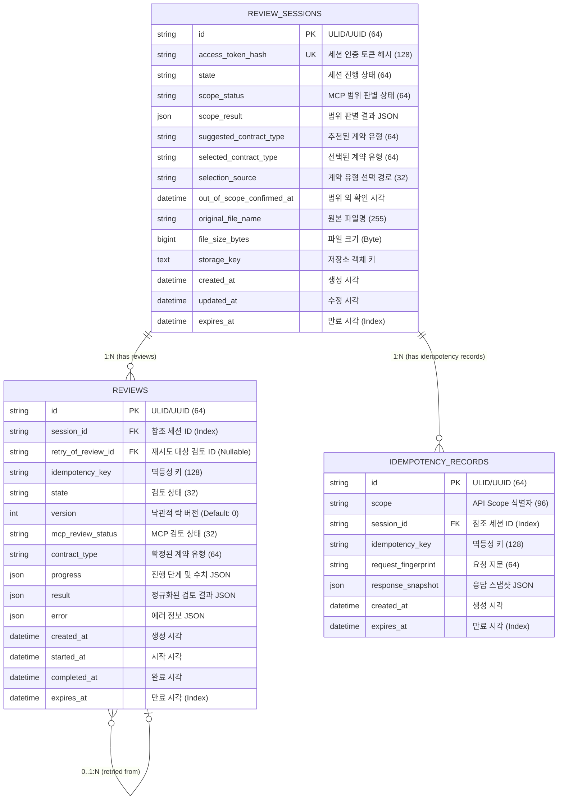

# 데이터베이스 ERD 및 도메인 데이터 구조 명세서

본 문서는 WorkShield 시스템의 persistence 레이어(SQLAlchemy ORM) 테이블 구조와 `api/app/domains`에 정의된 핵심 도메인 데이터 모델 및 이들 간의 관계를 정리합니다.

---

## 1. ERD 다이어그램 (Mermaid)



---

## 2. 테이블 상세 명세

### 2.1. `review_sessions` (검토 세션)
계약서 파일 업로드부터 계약 유형 판별/선택 및 검토 준비 단계까지의 세션 정보를 관리하는 **Aggregate Root** 테이블입니다.

| 컬럼명 | 데이터 타입 | Key | Nullable | 설명 |
| :--- | :--- | :---: | :---: | :--- |
| `id` | `VARCHAR(64)` | **PK** | No | 검토 세션 고유 식별자 |
| `access_token_hash` | `VARCHAR(128)` | **UK** | No | 세션 접근용 비공개 토큰의 SHA-256 해시값 |
| `state` | `VARCHAR(64)` | - | No | 세션 라이프사이클 상태 (`ReviewSessionState`) |
| `scope_status` | `VARCHAR(64)` | - | Yes | MCP 계약 범위 분석 상태 (`ScopeStatus`) |
| `scope_result` | `JSON` | - | Yes | MCP 계약 범위 분석 상세 결과 객체 |
| `suggested_contract_type` | `VARCHAR(64)` | - | Yes | AI가 추천한 계약 유형 |
| `selected_contract_type` | `VARCHAR(64)` | - | Yes | 사용자가 최종 선택한 계약 유형 |
| `selection_source` | `VARCHAR(32)` | - | Yes | 선택 경로 (`SelectionSource`: SUGGESTED, CANDIDATE, MANUAL) |
| `out_of_scope_confirmed_at` | `DATETIME` | - | Yes | 사용자가 범위 외 계약 진행을 수동 확정한 시각 |
| `original_file_name` | `VARCHAR(255)` | - | No | 업로드된 계약서 원본 파일명 |
| `file_size_bytes` | `BIGINT` | - | No | 파일 크기 (바이트 단위) |
| `storage_key` | `TEXT` | - | Yes | 파일 Storage (S3/MinIO 등) 내 저장 위치 키 |
| `created_at` | `DATETIME` | - | No | 세션 생성 시각 (Timezone 포함) |
| `updated_at` | `DATETIME` | - | No | 세션 최종 변경 시각 (Timezone 포함) |
| `expires_at` | `DATETIME` | **Index** | No | 세션 및 파일 자동 파기 만료 시각 |

---

### 2.2. `reviews` (검토 작업 및 결과)
특정 검토 세션(`review_sessions`)에 대해 실행된 MCP 법률 검토 파이프라인의 진행 상태, 결과 스냅샷 및 에러를 보관하는 테이블입니다.

| 컬럼명 | 데이터 타입 | Key | Nullable | 설명 |
| :--- | :--- | :---: | :---: | :--- |
| `id` | `VARCHAR(64)` | **PK** | No | 검토 작업 고유 식별자 |
| `session_id` | `VARCHAR(64)` | **FK** | No | `review_sessions.id` (ON DELETE CASCADE) |
| `retry_of_review_id` | `VARCHAR(64)` | **FK** | Yes | `reviews.id` (재시도 시 이전 검토 ID, ON DELETE SET NULL) |
| `idempotency_key` | `VARCHAR(128)` | **UQ** | No | 클라이언트 멱등성 요청 키 |
| `state` | `VARCHAR(32)` | - | No | 검토 작업 상태 (`ReviewState`) |
| `version` | `INT` | - | No | 동시성 제어를 위한 버전 (Default: 0) |
| `mcp_review_status` | `VARCHAR(32)` | - | Yes | MCP 원본 검토 응답 상태 (`MCPReviewStatus`) |
| `contract_type` | `VARCHAR(64)` | - | No | 검토 대상 확정 계약 유형 |
| `progress` | `JSON` | - | Yes | 실시간 진행률 및 시퀀스 스냅샷 (`ProgressSnapshot`) |
| `result` | `JSON` | - | Yes | 정규화된 검토 분석 최종 결과 |
| `error` | `JSON` | - | Yes | 실패 원인 및 재시도 가능 여부 등의 에러 객체 |
| `created_at` | `DATETIME` | - | No | 검토 생성 시각 |
| `started_at` | `DATETIME` | - | Yes | MCP 파이프라인 실제 실행 시작 시각 |
| `completed_at` | `DATETIME` | - | Yes | 검토 완료/실패/취소 처리 시각 |
| `expires_at` | `DATETIME` | **Index** | No | 민감 검토 결과 자동 파기 만료 시각 |

- **제약 조건**: `UQ_reviews_session_idempotency` (`session_id`, `idempotency_key`) UNIQUE

---

### 2.3. `idempotency_records` (멱등성 기록)
동일 세션 내 중복 요청 방지 및 멱등한 API 응답 재사용을 위한 요청 지문과 응답 스냅샷 보관 테이블입니다.

| 컬럼명 | 데이터 타입 | Key | Nullable | 설명 |
| :--- | :--- | :---: | :---: | :--- |
| `id` | `VARCHAR(64)` | **PK** | No | 멱등성 레코드 고유 ID |
| `scope` | `VARCHAR(96)` | **UQ** | No | API 엔드포인트/작업 범위 (예: `review_sessions:select_type`) |
| `session_id` | `VARCHAR(64)` | **FK, UQ** | No | `review_sessions.id` (ON DELETE CASCADE) |
| `idempotency_key` | `VARCHAR(128)` | **UQ** | No | 클라이언트가 전달한 멱등성 키 |
| `request_fingerprint` | `VARCHAR(64)` | - | No | 요청 페이로드의 SHA-256 해시 지문 |
| `response_snapshot` | `JSON` | - | No | 캐싱하여 재응답할 API 응답 데이터 JSON |
| `created_at` | `DATETIME` | - | No | 레코드 생성 시각 |
| `expires_at` | `DATETIME` | **Index** | No | 레코드 만료 시각 |

- **제약 조건**: `UQ_idempotency_scope_session_key` (`scope`, `session_id`, `idempotency_key`) UNIQUE

---

## 3. 핵심 Enum 및 Value Object 명세

### 3.1. `ReviewSessionState` (세션 상태)
- `ANALYZING_CONTRACT_TYPE`: 파일 업로드 직후, 계약 유형 및 범위 자동 판별 중
- `TYPE_SELECTION_REQUIRED`: AI 추천 유형 및 후보 중 사용자의 계약 유형 선택 대기
- `OUT_OF_SCOPE_CONFIRMATION_REQUIRED`: 표준 계약서 범위를 벗어나 사용자 수동 확인 대기
- `READY_TO_REVIEW`: 계약 유형 확정 완료, 본 검토 시작 가능 상태
- `REUPLOAD_REQUIRED`: 파싱 불가능한 문서 등으로 재업로드 필요
- `FAILED`: 파일 검증 또는 분석 실패
- `EXPIRED`: 세션 유효 기간 만료

### 3.2. `ReviewState` (검토 작업 상태)
- `QUEUED`: 검토 작업 대기열 등록 완료
- `REVIEWING`: MCP 법률 검토 파이프라인 수행 중
- `COMPLETED`: 검토 성공적 완료 (결과 보관 중)
- `FAILED`: 검토 실패 또는 중단
- `CANCELLED`: 사용자에 의해 검토 취소 및 민감 데이터 파기됨
- `EXPIRED`: 검토 결과 만료 시각 도달로 파기됨

### 3.3. `ProgressStage` (검토 진행 단계)
1. `PREPARE`: 작업 준비 및 초기 설정
2. `BATCH_SEARCH`: 표준 조항 및 근거 법령 탐색
3. `RERANK`: 연관 법령 및 조항 재순위화
4. `CLAUSE_REVIEW`: 개별 조항별 위험도/독소조항 심층 분석
5. `MISSING_DETECTION`: 필수 누락 조항 탐색
6. `RESULT_ASSEMBLY`: 검토 결과 통합 및 최종 정리

---

## 4. 도메인별 JSON 필드 세부 구조 (Domain Schemas)

 persistence 테이블의 `JSON` 타입 컬럼에 포함되는 도메인 객체 데이터 구조입니다.

### 4.1. `scope_result` (Grounding 도메인)
`review_sessions.scope_result`에 저장되는 데이터 구조입니다.
```json
{
  "decision": "IN_SCOPE | CONTRACT_TYPE_UNCERTAIN | OUT_OF_SCOPE | EMPTY_DOCUMENT",
  "suggested_contract_type": "IT_DEVELOPMENT | GENERAL_BUYING | ...",
  "candidate_contract_types": ["IT_MAINTENANCE", "SW_LICENSE"],
  "confidence": 0.95,
  "reason": "계약서 서두 및 조항 문맥 분석 결과 IT 외주 개발 계약서로 판단됨"
}
```

### 4.2. `result` (Reviews 도메인)
`reviews.result`에 저장되는 정규화된 최종 검토 결과 구조입니다.
```json
{
  "summary": {
    "total_clauses": 15,
    "reviewed_clauses": 15,
    "high_risk_count": 2,
    "medium_risk_count": 3,
    "low_risk_count": 10,
    "overall_risk_level": "HIGH"
  },
  "clause_reviews": [
    {
      "clause_number": "제7조",
      "title": "손해배상",
      "risk_level": "HIGH",
      "issues": ["손해배상 책임 한도가 미설정되어 배상 위험 과다"],
      "grounding": {
        "standard_clause": "표준 지체상금 및 손해배상 한도 조항",
        "relevant_statutes": ["약관의 규제에 관한 법률 제6조"]
      },
      "suggestions": ["손해배상 총액을 계약금액의 100%로 제한하는 조항 추가 권장"]
    }
  ],
  "missing_clauses": [
    {
      "category": "지식재산권",
      "importance": "CRITICAL",
      "description": "산출물에 대한 지식재산권 귀속 조항이 누락됨"
    }
  ]
}
```

### 4.3. `progress` (Reviews 도메인)
`reviews.progress`에 단조 증가 규칙으로 기록되는 시퀀스 스냅샷입니다.
```json
{
  "sequence": 4,
  "stage": "CLAUSE_REVIEW",
  "current": 8.0,
  "total": 15.0,
  "percent": 53,
  "message": "8번째 조항 분석 중입니다."
}
```

---

## 5. 도메인 간 관계 요약

1. **ReviewSession - Review (1 : N)**
   - 1개의 검토 세션(`review_sessions`) 내에서 사용자는 동일/재시도 조건으로 여러 번 검토(`reviews`)를 수행할 수 있습니다.
   - 세션 삭제 시 연관된 검토 내역 및 멱등성 레코드는 `CASCADE` 삭제됩니다.
2. **Review - Review Self-Reference (0..1 : N)**
   - 검토 실패나 조건 변경 후 재시도 시 `retry_of_review_id`를 통해 이전 검토 작업과의 히스토리를 추적할 수 있습니다.
3. **ReviewSession - IdempotencyRecord (1 : N)**
   - API 중복 호출 방지 및 멱등 응답 보장을 위해 세션별 요청 멱등성 레코드가 보관됩니다.
